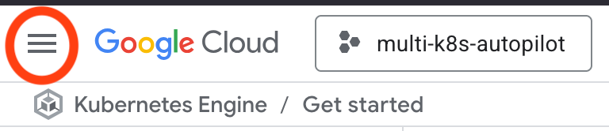
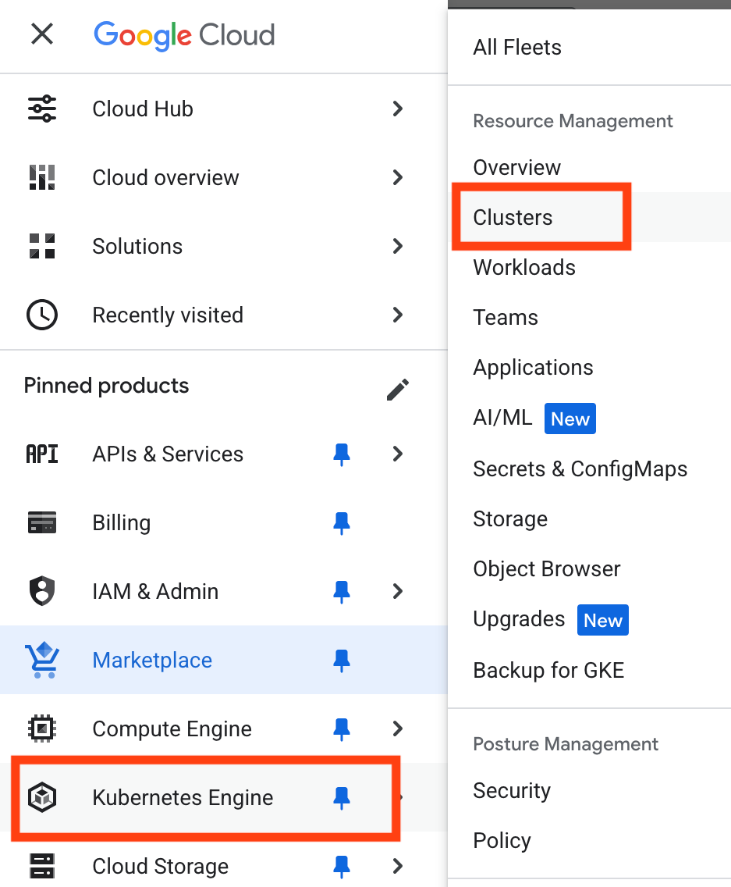
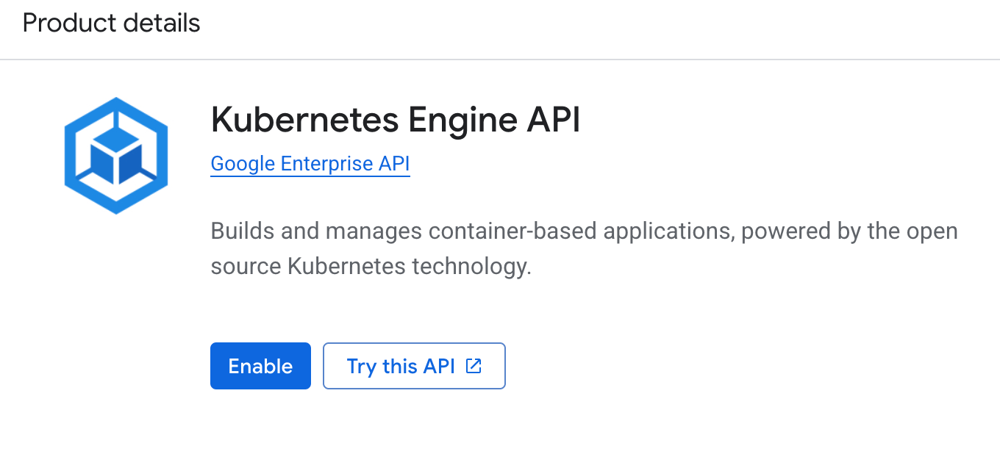
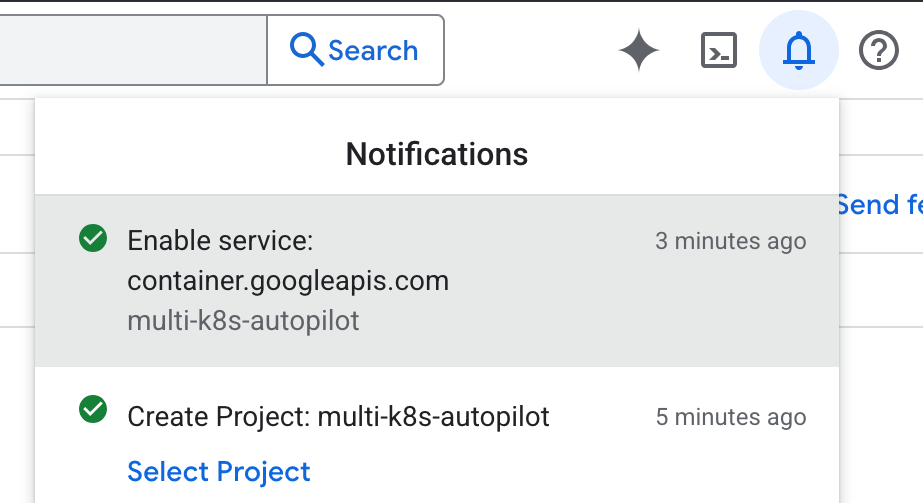
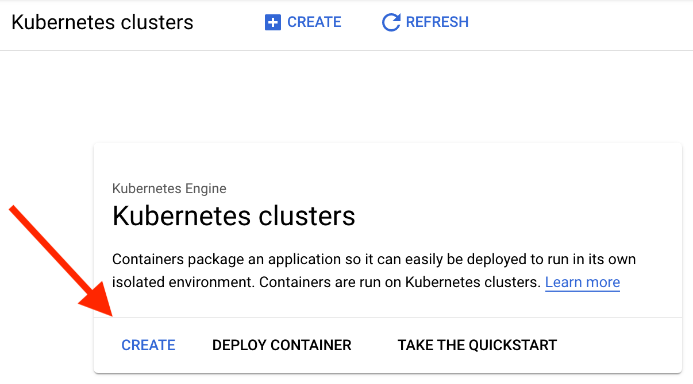
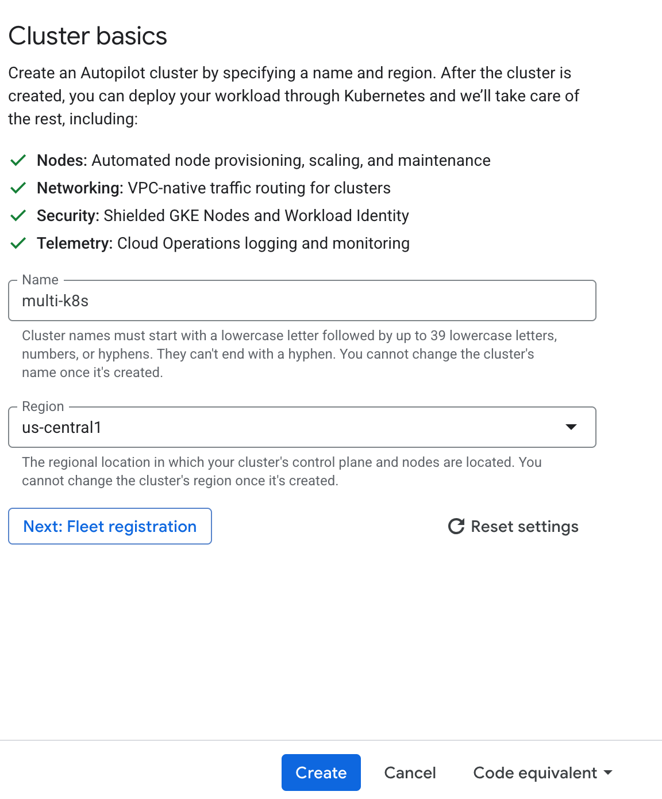
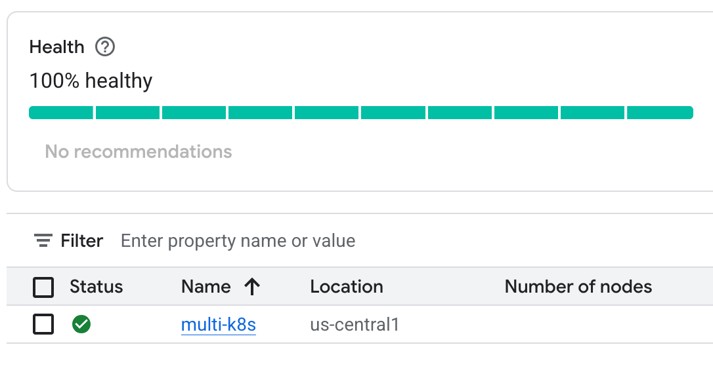

GKE Creation Steps Using Autopilot
This will contain all of the steps required to create a Kubernetes cluster with GKE. It will be regularly updated as the GCP UI changes.

1. Click the Hamburger menu on the top left-hand side of the dashboard.

2. Click Kubernetes Engine, then Clusters

3. Click the ENABLE button to enable the Kubernetes API for this project.

4. After a few minutes of waiting, clicking the bell icon in the top right part of the menu should show a green checkmark for Enable services: container.googleapis.com

5. If you refresh the page, it should show a screen to create your first cluster. If not, click the hamburger menu and select Kubernetes Engine and then Clusters.
Once you see the screen below, click the CREATE button.

6. A Create Cluster dialog will open and default to Autopilot. This will be the cheaper option at around $5 per day and will require no setup or configuration. The Standard cluster creation will cost upwards of $350 per month. Give the cluster a name and click the Create button.

7. After a few minutes, the cluster dashboard should load and your multi-cluster should have a green checkmark in the table.

One detail that you will need to remember is that Autopilot uses regions and not zones. We will post a reminder edit to the lectures that make reference to the old standard cluster zones.

Also, Autopilot will automatically add or remove Nodes based on workload demand. So, you will not see any reference to Node Pools or Node configurations as you would have with a Standard cluster.

Remember, as long as this cluster is running you will be billed real-life money! The autopilot cluster costs about $150 a month, the standard cluster can cost in excess of $350!